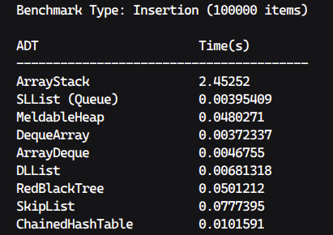
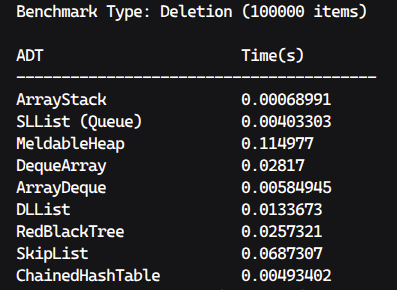
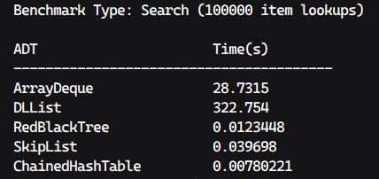
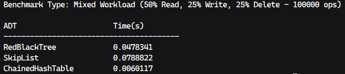
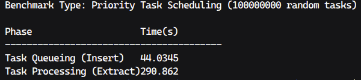

# 📊 Benchmark Results

This document contains the performance profiling and benchmarking results for the **DSA Madness** library. 

## 💻 Test Environment
All benchmarks were compiled with the `-O3` optimization flag and executed on the following system:

* **Host Machine:** ThinkPad T480s
* **CPU:** Intel Core i7-8550U
* **RAM:** 16GB DDR4 (2400MT/s)
* **OS:** Linux Mint 22.3

## 📈 Performance Screenshots

### 1. Insertion Benchmarks
*(100,000 items inserted into each ADT)*

### 2. Deletion Benchmarks
*(100,000 items removed from each ADT)*

### 3. Search / Lookup Benchmarks
*(100,000 item lookups in supported ADTs)*

### 4. Mixed Workload
*(50% Read, 25% Write, 25% Delete operations)*

### 5. Priority Scheduling
*(100000000 random tasks - Inserting and Extracting)*

